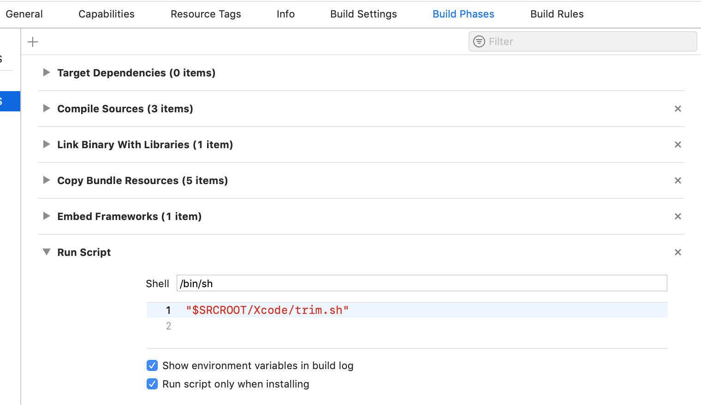

# WannatalkAPI-iOS
The official Wannatalk Messenger Objective-C (iOS) API

## To run sample example
1. Request **WTService-Info.plist** from [wannatalk.ai](https://wannatalk.ai)
2. Drag your **WTService-Info.plist** file into the sample application. When prompted, select **"Copy items if needed"** and continue.
3. That's it! Run the app

## Steps to integrate wannatalksdk into your project
1. **SDK Integration**
- CocoaPods
	- Add below line to your podfile:
      ```pod 'WTExternalSDK', :git =>'https://github.com/edzehoo/WannatalkAPI-iOS.git', :tag => '1.3.4'```
  
	- Run  `pod install`

- Manual Integration
	- Drag the **WTExternalSDK.framework** into your application. When prompted, select **"Copy items if needed"** and continue.
	- Go to app target’s General configuration page and add *WTExternalSDK.framework* in `Embedded Binaries`
2. Drag your **WTService-Info.plist** into your application. When prompted, select **"Copy items if needed"** and continue.
3. Set *Always Embed Swift Standard Libraries* to *Yes* in Build Settings of your application target
4. Add below keys in your application's Info.plist

    ```
   <key>NSPhotoLibraryUsageDescription</key>
   <string>To save in-chat photos and videos</string>
   <key>NSContactsUsageDescription</key>
   <string>To locate friends already on the Wannatalk network</string>
   <key>NSCameraUsageDescription</key>
   <string>To take photos and videos to send to friends in-chat</string>
   <key>NSLocationWhenInUseUsageDescription</key>
   <string>To display it in map</string>
   <key>NSMicrophoneUsageDescription</key>
   <string>To record live photos and movies</string>
	  ```
5. Add below line in **application:didFinishLaunchingWithOptions:** method of your AppDelegate.m
```
//#import <WTExternalSDK/WTExternalSDK.h>
[[WTSDKApplicationDelegate sharedInstance] application:application didFinishLaunchingWithOptions:launchOptions];
```
## To strip simulator architecture framework for your app submission
1. Copy **trim.sh** file into your project folder.
2. Create Run Script Phase in Build Phases of your application target.
3. Paste `"$SRCROOT/trim.sh"` inside the body of Run Script Phase.
4. Enable `Run script only when installing` and `Show environment variables in build log`.


## To link Wannatalk account
    [[WTLoginManager sharedInstance] loginFromVC:self];

## To link Wannatalk account without otp verification
    NSDictionary *userInfo = @{ @"key1": @"value1", @"key2": @"value2"};
    [[WTLoginManager sharedInstance] silentLoginWithIdentifier:@"<your_phone_number>" userInfo:userInfo fromVC:self];

## HelpDesk
### To load your organization profile
    // - (void) pushOrgProfileVCWithAutoOpenChat:(BOOL) autoOpenChat delegate:(id <WTSDKManagerDelegate>) delegate animated:(BOOL) animated;
    // Recent chat page will be opened when click on channel if autoOpenChat is true, otherwise chat list page will be opened.
    
    [self.navigationController pushOrgProfileVCWithAutoOpenChat:YES delegate:self animated:YES];
    
    or
    
    [self presentOrgProfileVCWithAutoOpenChat:YES delegate:self animated:YES completion:nil];

## Collaboration
### To view all chats
    [self.navigationController pushChatListVCWithDelegate:self animated:YES];
    
### To view all users
    [self.navigationController pushUsersVCWithDelegate:self animated:YES];

## Push notifications
1. Generate APNs certificate for development and production and send us p12 files with their passwords. 
2. Please include below methods in your app’s AppDelegate class.
```
    - (void)application:(UIApplication *)application didRegisterForRemoteNotificationsWithDeviceToken:(NSData *)deviceToken {  
        [[WTSDKApplicationDelegate sharedInstance] application:application didRegisterForRemoteNotificationsWithDeviceToken:deviceToken]; 
    }
        
    - (void)application:(UIApplication *)application didReceiveRemoteNotification:(NSDictionary *)userInfo { 
        [[WTSDKApplicationDelegate sharedInstance] application:application didReceiveRemoteNotification:userInfo];
    }
        
    - (void) application:(UIApplication *)application handleActionWithIdentifier:(NSString *)identifier forLocalNotification:(UILocalNotification *)notification completionHandler:(void (^)())completionHandler { 
        [[WTSDKApplicationDelegate sharedInstance] application:application handleActionWithIdentifier:identifier forLocalNotification:notification completionHandler:completionHandler]; 
    }
        
    - (void) application:(UIApplication *)application handleActionWithIdentifier:(NSString *)identifier forLocalNotification:(UILocalNotification *)notification withResponseInfo:(NSDictionary *)responseInfo completionHandler:(void (^)())completionHandler {  
        [[WTSDKApplicationDelegate sharedInstance] application:application handleActionWithIdentifier:identifier forLocalNotification:notification withResponseInfo:responseInfo completionHandler:completionHandler]; 
    } 
```
## Other
### Show or hide guide button
    [WTSDKManager ShowGuideButton:NO]; // Default Value: true

### To show or hide Profile Info page
    [WTSDKManager ShowProfileInfoPage:NO]; // Default Value: true

### To show or hide Add Participants in chat item profile
    [WTSDKManager ShouldAllowAddParticipant:NO]; // Default Value: true

### To show or hide microphone in chat page
    [WTSDKManager ShouldAllowSendAudioMessage:NO]; // Default Value: true

### To show or hide welcome message
    [WTSDKManager ShowWelcomeMessage:NO]; // Default Value: false

### To create auto tickets: All tickets will create automatically when autotickets is true, otherwise user have to enter subject to create ticket
    [WTSDKManager EnableAutoTickets:YES]; // Default Value: false

### To enable or disbale chat profile page
    [WTSDKManager EnableChatProfile:NO]; // Default Value: true
    
### To show or hide close button in chat page
    [WTSDKManager ShowExitButton:YES]; // Default Value: false
    
### To show or hide participants in chat profile page
    [WTSDKManager ShowChatParticipants:NO]; // Default Value: true
